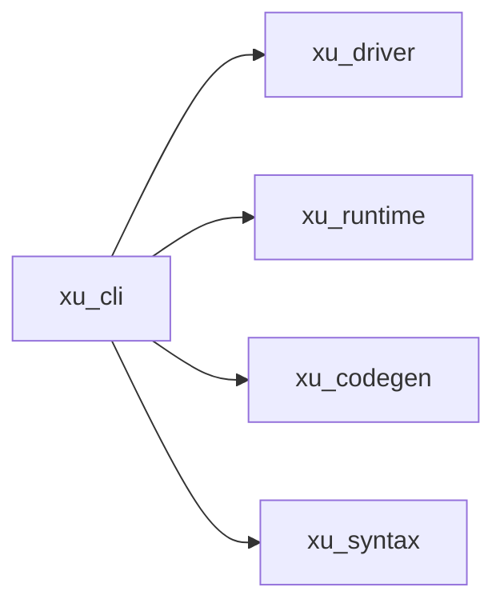
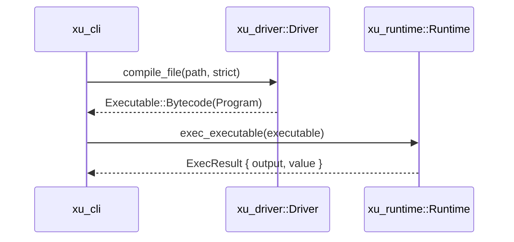

# xu_cli

`xu` 命令行工具入口：把“文件路径 + 运行参数”转成前端编译结果，并驱动运行时执行或代码生成。

## 在整体架构中的位置

- 入口：用户侧命令 `xu <tokens|check|ast|run|codegen>`
- 依赖：`xu_driver`（前端编排）、`xu_runtime`（执行）、`xu_codegen`（跨语言生成）、`xu_syntax`（诊断渲染）
- 对应总览：见仓库文档 [docs/ARCHITECTURE.md](../../docs/ARCHITECTURE.md)

## 关键入口

- 主入口：`src/main.rs`
  - `tokens`：打印 Token（跳过换行）
  - `check`：打印诊断，存在 Error 退出码为 1
  - `ast`：打印 AST（可选 `--timing` 输出耗时）
  - `run`：`Driver::compile_file` → `Runtime::exec_executable`
  - `codegen`：目录/文件模式，将 Xu AST 转 JS/Python

## `run` 的主路径（默认字节码）

## 设计要点

- 诊断渲染由 `xu_syntax::render_diagnostic` 统一输出格式，便于工具链/CI 消费
- `run` 会向运行时注入：
  - `strict` 变量策略
  - `frontend`（用于运行时动态 `引入` 时编译被引入模块）
  - `entry_path` 与 `stdlib_path`（标准库定位）
  - `args`（脚本参数）

## 测试

- `crates/xu_cli/tests`：回归与 CLI 行为测试（包含循环引入、严格模式、codegen 目录模式等）
