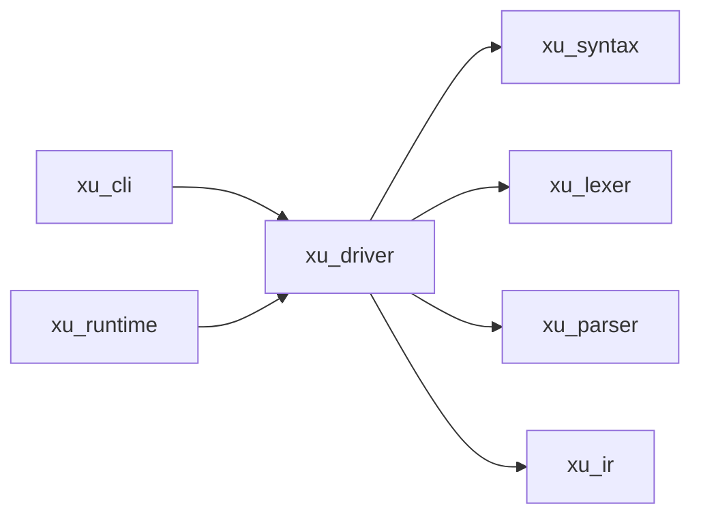
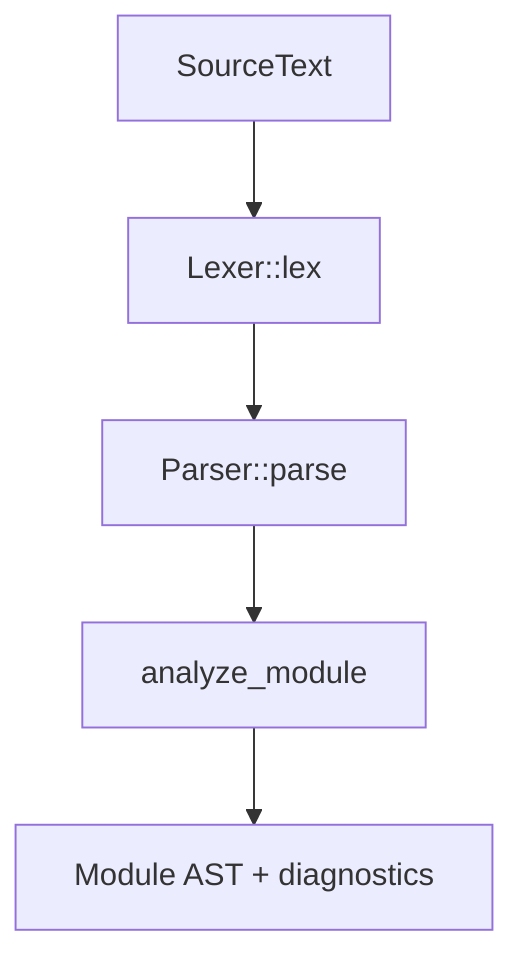

# xu_driver

前端“编排层”：把 `normalize/lex/parse/analyze/compile` 组织成稳定的对外 API，并为运行时提供可复用的 `Frontend` 接口（用于动态引入时编译）。

## 在整体架构中的位置

- 上游：`xu_cli`（命令行）、`xu_runtime`（动态 `引入` 时调用前端）
- 下游：`xu_syntax`（Source/Span/Diagnostic）、`xu_lexer`、`xu_parser`、`xu_ir`
- 总览：见 [docs/ARCHITECTURE.md](../../docs/ARCHITECTURE.md)



## 核心对象

- `Driver`：对外门面（Facade），提供：
  - `lex_file / lex_text`
  - `parse_file / parse_text / parse_text_timed`
  - `compile_file`
- `ImportCache`：用于跨文件/模块分析的缓存（运行时与前端都需要“按规范化路径缓存”的能力）

入口实现：`src/frontend.rs`。

## 典型数据流

### 解析 + 静态分析



### 编译为可执行产物

```mermaid
flowchart TD
  AST[Module AST] --> BC[bytecode_compiler::compile_module]
  BC --> EXE[Executable::Bytecode(Program)]
```

## 与运行时的契约（Frontend trait）

- `xu_ir::Frontend` 定义了最小接口：`compile_text_no_analyze`
- `Driver` 在实现该接口时，刻意跳过静态分析：
  - 场景：运行时动态加载模块时需要“可执行 + 诊断”，但不应引入过多全局状态依赖
  - 输出：`xu_ir::CompiledUnit { text, executable, diagnostics }`

## 测试

- `crates/xu_driver/tests`：以“静态分析行为”为主的测试（例如类型相关参数化测试）
