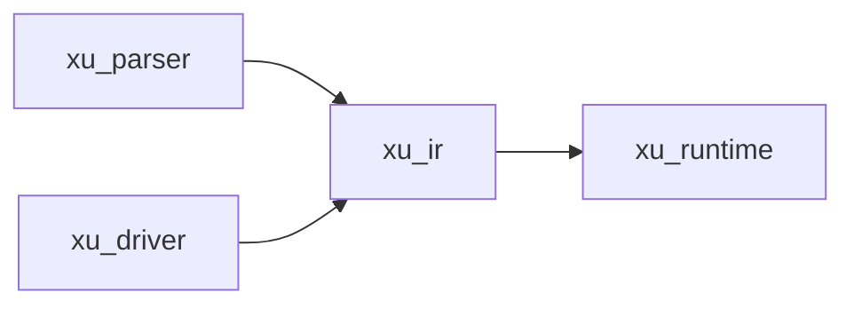

# xu_ir

实现层之间的“共享语言”：统一承载 AST（语法树）与 Bytecode（字节码），并通过 `Executable` 把“可运行产物”的形态抽象出来。

## 在整体架构中的位置

- 上游：`xu_parser` 产出 AST；`xu_driver` 产出 Bytecode
- 下游：`xu_runtime` 消费 `Executable`（AST 路径或 Bytecode 路径）
- 总览：见 [docs/ARCHITECTURE.md](../../docs/ARCHITECTURE.md)



## 关键类型

- AST：`Module / Stmt / Expr / TypeRef ...`（`src/ast.rs`）
- Bytecode：`Bytecode / Op ...`（`src/bytecode.rs`）
- `Program`：`{ module, bytecode }`（`src/program.rs`）
- `Executable`：`Ast(Module)` 或 `Bytecode(Program)`（`src/executable.rs`）
- `Frontend`：运行时可插拔的编译前端（`src/frontend.rs`）

## Executable 双路径

同一份源码可以以不同形态进入运行时：

```mermaid
flowchart TD
  S[SourceText] --> AST[Module AST]
  AST -->|Executable::Ast| A[xu_runtime::Runtime::exec_module]
  AST --> BC[Bytecode compile]
  BC -->|Executable::Bytecode(Program)| B[xu_runtime::Runtime::exec_program]
  B --> VM[VM: run_bytecode]
```

保留双路径的意义：

- AST 路径：更适合调试与语义对照（可直接在解释器层逐节点求值）
- Bytecode 路径：更适合性能与可控的执行模型（指令循环、局部变量槽位等）

## 演进约束（建议）

- AST 与 Bytecode 的语义需保持同构：新增语法/语义时，优先在 AST 与 VM 两条路径同时补齐
- `Executable` 是跨 crate 的稳定边界：避免把上层实现细节泄漏到 runtime
