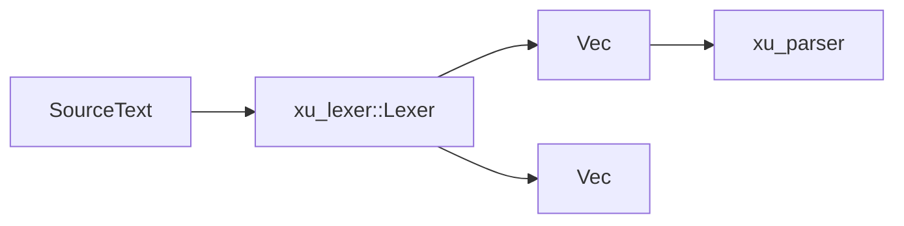

# xu_lexer

词法分析与源码归一化：将源文本切分为 Token 流，并生成基础诊断（非法空白、缩进、标点等）。

## 在整体架构中的位置

- 上游：任意源码输入（CLI、运行时动态加载）
- 下游：`xu_parser` 消费 Token 流；`xu_driver` 负责组装并汇总诊断
- 总览：见 [docs/ARCHITECTURE.md](../../docs/ARCHITECTURE.md)

## 关键入口

- `Lexer::lex`：主入口（`src/lexer.rs`）
- `normalize_source`：归一化工具（`src/normalize.rs`）

## 词法层的关键约束

- 缩进块：在行首处理缩进，生成 `INDENT/DEDENT`，并用栈维护层级
- 分隔符深度：括号/中括号/大括号内通常抑制“行首缩进语义”，避免多行表达式被误判为块结构
- 标点兼容：支持中英文标点混用（由 `TokenKind` 与 punct 规则承载）

## 测试

- `crates/xu_lexer/tests`：包含 smoke、punct 规则、proptest fuzz 等
