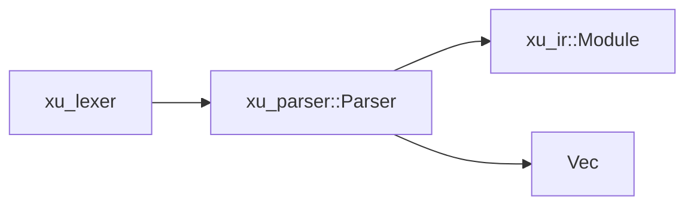

# xu_parser

语法分析（Token → AST）：将 `xu_lexer` 的 Token 流解析为 `xu_ir::Module`，并在错误场景下尽可能恢复以继续产出 AST 与诊断。

## 在整体架构中的位置

- 上游：`xu_lexer` 输出的 Token 流
- 下游：`xu_driver` 做静态分析/编译；`xu_codegen` 与 `xu_runtime` 也会消费 AST
- 总览：见 [docs/ARCHITECTURE.md](../../docs/ARCHITECTURE.md)

## 关键入口

- `Parser::parse`：主入口（`src/parser.rs`）
- `ParseResult { module, diagnostics }`：解析结果

## 解析策略（实现侧约定）

- Pratt 表达式解析：用于统一处理操作符优先级与结合性
- 语句/块结构：结合 `INDENT/DEDENT` 处理缩进块
- 错误恢复：以语句结束符、换行、`DEDENT` 等作为同步点，避免“一错全错”
- 插值缓存：对字符串插值表达式做缓存，减少重复解析成本

## 测试

- `crates/xu_parser/tests/golden`：tokens/ast/diagnostics 快照
- `crates/xu_parser/tests/*`：包含 proptest fuzz、import sugar、插值等专项回归
