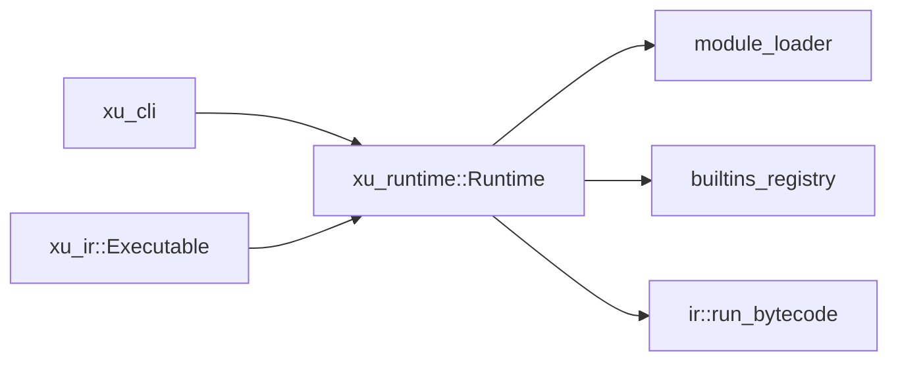

# xu_runtime

运行时与虚拟机：负责模块加载、内置函数/标准库注册、环境与堆管理，以及 AST/字节码两种形态的执行。

## 在整体架构中的位置

- 上游：`xu_cli`（驱动执行），`xu_driver`（作为可插拔前端供动态引入使用）
- 下游：直接对外提供 `Runtime`，并消费 `xu_ir::Executable`
- 总览：见 [docs/ARCHITECTURE.md](../../docs/ARCHITECTURE.md)



## 核心对象与入口

- `Runtime`：核心执行上下文（见 `src/runtime/mod.rs`）
  - `exec_executable`：统一入口，分发到 `exec_module` 或 `exec_program`
  - `set_frontend`：注入 `xu_ir::Frontend`（供运行时 `引入` 编译用）
  - `set_entry_path / set_stdlib_path / set_args`：注入执行所需的路径与参数
- VM：字节码解释循环（`src/runtime/ir.rs`）
- 模块加载：路径解析、缓存、循环检测（`src/runtime/module_loader.rs`）
- 内置与能力：
  - builtins：`src/runtime/builtins*.rs`
  - capabilities：`src/runtime/capabilities.rs`（IO/Clock 等可替换能力，便于测试与沙箱化）

## 执行模型（高层）

### 入口执行

- 每次执行会重置运行时状态（输出缓冲、模块缓存、结构体/枚举注册、局部变量槽位等）
- 执行结束后，若定义了 `主程序` 且为函数，会自动调用一次

### AST 与字节码

```mermaid
flowchart TD
  EXE[Executable] -->|Ast(Module)| AST[exec_module]
  EXE -->|Bytecode(Program)| BC[exec_program]
  BC --> VM[run_bytecode]
```

## 模块系统（运行时视角）

- `引入` 发生时，运行时负责：
  - 解析路径（相对导入优先以导入方文件目录为基准）
  - 规范化路径并做缓存（避免重复加载）
  - 检测循环引入并给出路径链条（便于定位）
- 标准库：
  - 通过 `stdlib_path` 指向仓库的 `stdlib/` 目录
  - `xu_cli` 会尝试从可执行文件位置或 CWD 推断并注入该路径

## 测试

- `crates/xu_runtime/tests/runner.rs`：统一测试入口（分策略跑 specs/edge/xu/benchmarks）
- `crates/xu_runtime/tests/*`：包含 golden、属性测试、性能基准与回归集合
