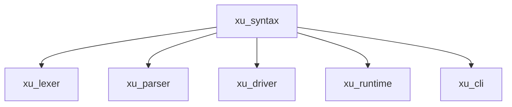

# xu_syntax

基础语法与诊断层：提供跨 crate 共享的 Source/Span/Token/Diagnostic 等核心类型，以及统一的诊断渲染与语言化（中/英）。

## 在整体架构中的位置

- 被广泛依赖：`xu_lexer / xu_parser / xu_driver / xu_runtime / xu_cli`
- 目标：把“定位与错误表达”抽成稳定底座，避免上层重复实现
- 总览：见 [docs/ARCHITECTURE.md](../../docs/ARCHITECTURE.md)

## 关键模块

- `SourceFile / SourceText`：承载文本与文件信息（`src/source.rs`）
- `Span`：字节区间定位（`src/span.rs`）
- `Token / TokenKind`：词法 token 与枚举（`src/token.rs`）
- `Diagnostic / DiagnosticKind / Severity`：结构化诊断（`src/diagnostic.rs`）
- `render_diagnostic`：统一的可读输出格式（`src/render.rs`）
- `Language`：中/英消息支持（`src/lib.rs` 与相关模块）

## 设计要点

- 行列映射：列号按“字符”计数（对中文友好），并尽量携带 `Span` 以便渲染上下文
- 诊断形态尽量结构化：上层只负责“产生 DiagnosticKind + Span + 参数”，渲染由底座统一完成
